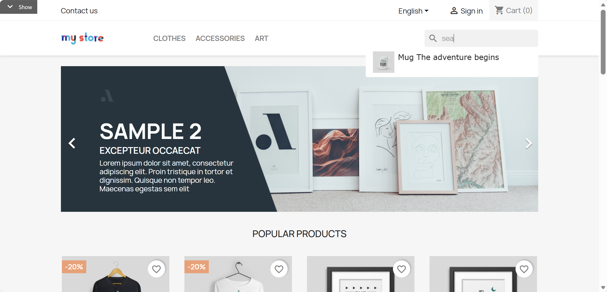
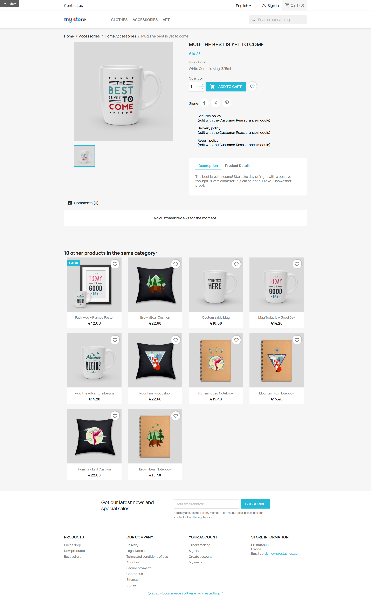
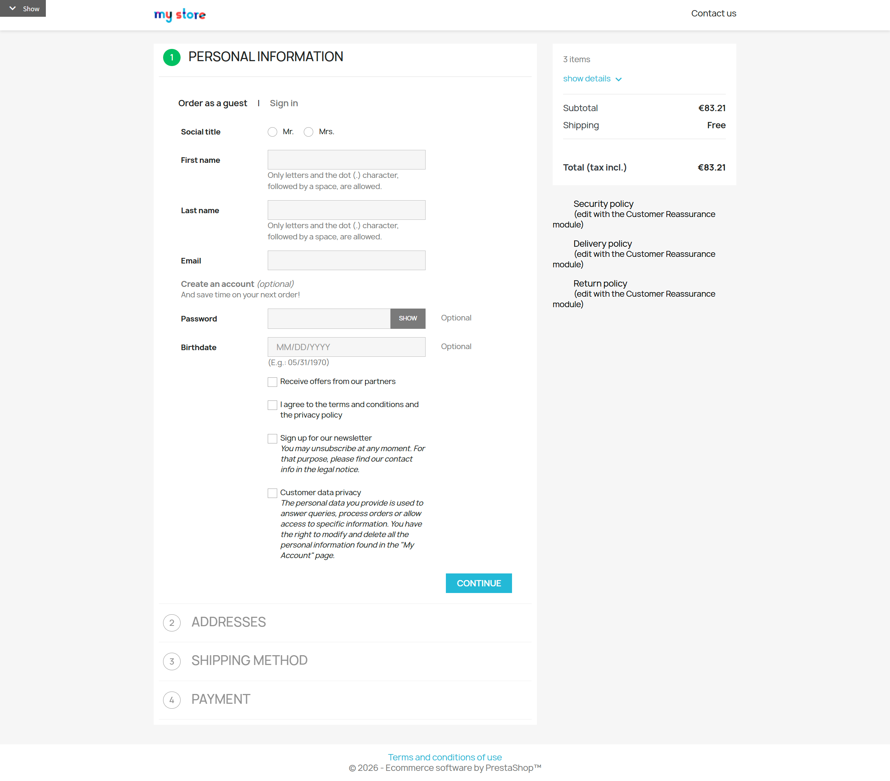
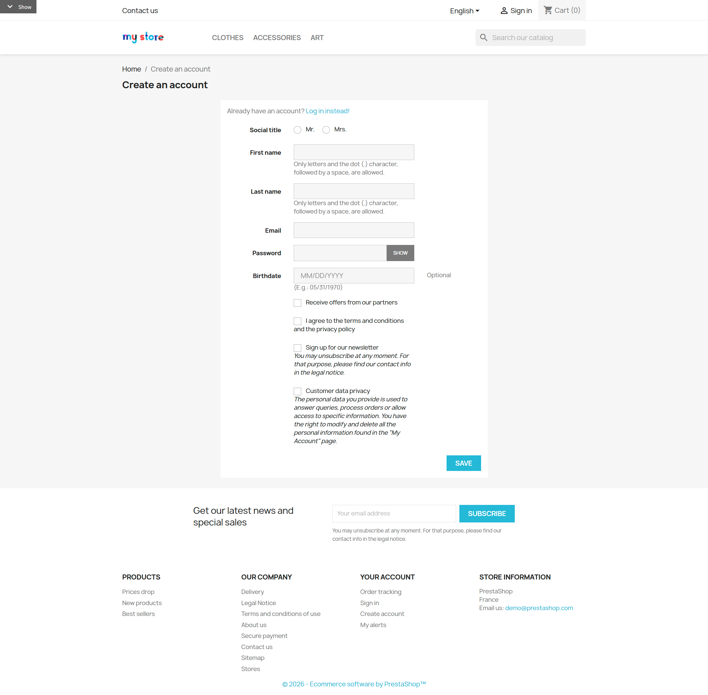
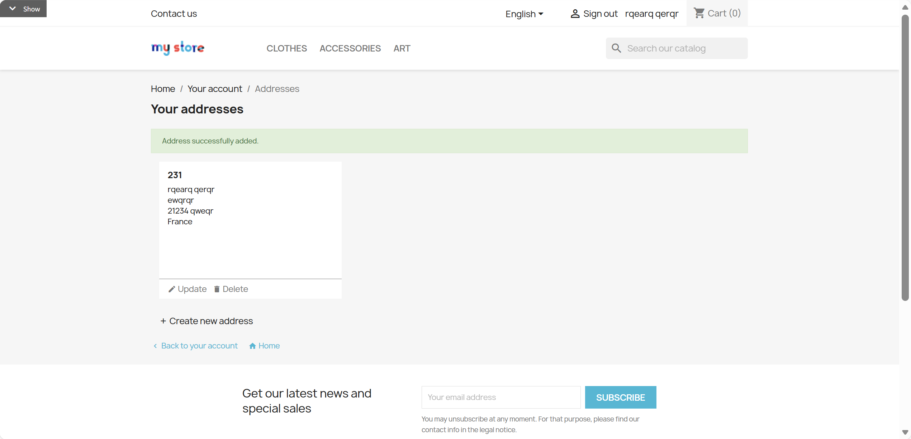
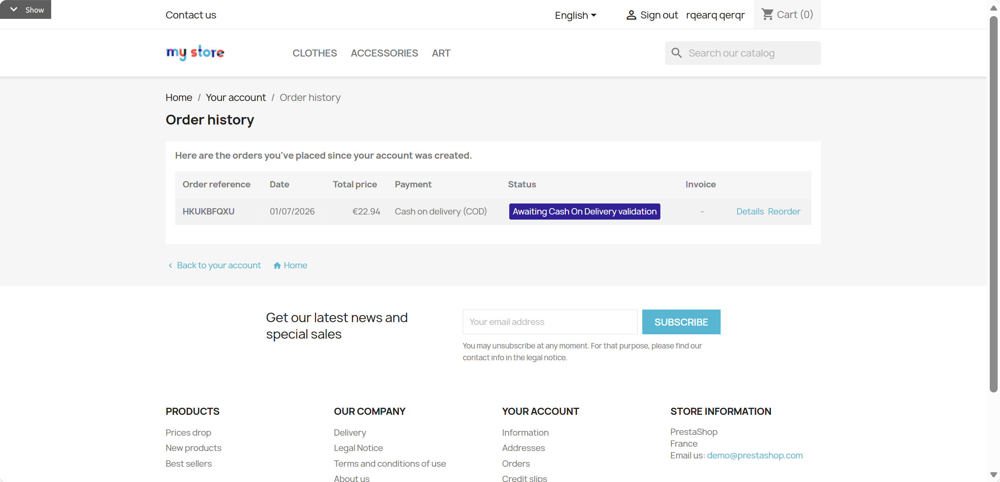
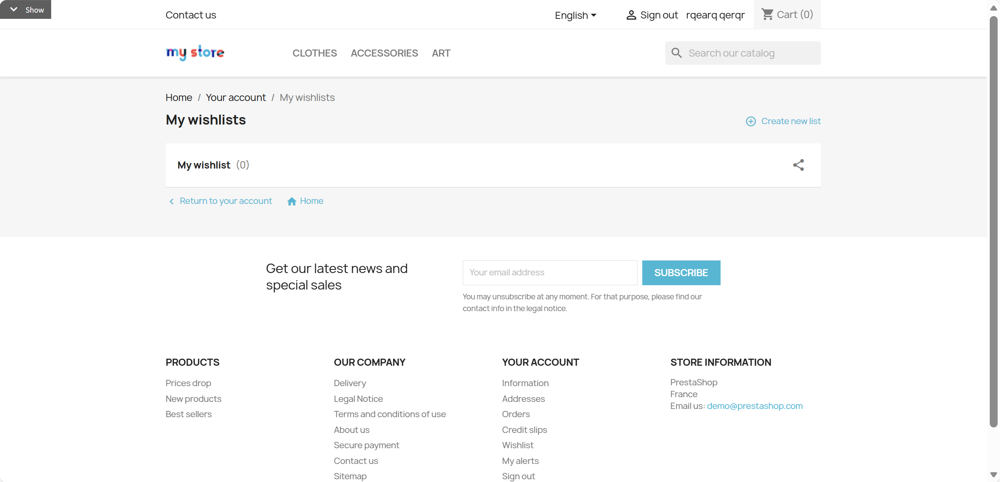

# PrestaShop E-commerce Website

PrestaShop B2C e-commerce website requirements covering storefront browsing, shopping cart, checkout, user authentication, and account management.

## REQ-0 Visit Homepage

Visit the homepage and expose the navigation bar, the textbox with accessible name "Search", the region with accessible name "Carousel", and the visible "Popular products" area.

**Type:** ATOMIC
**Dependencies:** None

**Scenarios:**

- Visit Homepage
  - **GIVEN:** User is in a web browser.
  - **WHEN:** Enter the website URL
  - **THEN:** Display the homepage with the navigation bar, a search box, the Carousel, and the Popular products area

## REQ-1 Global Navigation

Global navigation bar component at the top of the website, fixed display on all pages. Layout structure (left to right): Logo | Category Menu | Search Box | Language Selector | User Entry | Cart Icon. Navigation bar uses responsive design, collapses to hamburger menu on mobile. 

**Type:** FOLDER
**Dependencies:** None

### REQ-1.1 View Global Navigation

View the global navigation bar. Its navigation landmark has accessible name "Main navigation"; it contains the link with accessible name "Logo", visible button "Clothes", textbox with accessible name "Search", combobox with accessible name "Language", link with accessible name "Sign in", and link with accessible name "Shopping cart".

**Type:** ATOMIC
**Dependencies:** REQ-0

**Scenarios:**

- View Global Navigation
  - **GIVEN:** User is on a store page and can see the website header.
  - **WHEN:** Review the navigation area
  - **THEN:** Display Logo, category menu, search box, language selector, user entry, cart icon

### REQ-1.2 Logo Click Returns Home

Use visible button "Clothes" and link "Men" to leave the homepage, then click the link with accessible name "Logo" to return to the region with accessible name "Carousel".

**Type:** ATOMIC
**Dependencies:** None

**Scenarios:**

- Logo Click Returns Home
  - **GIVEN:** User is on any page and can see the website Logo in the header.
  - **WHEN:** Click the website Logo
  - **THEN:** Navigate back to homepage

### REQ-1.3 Category Menu

Horizontally arranged top-level category menu (e.g., CLOTHES, ACCESSORIES, ART). Hover to expand dropdown menu showing subcategories, supports multi-level nesting. The catalog contains the top-level category "CLOTHES" with the subcategories "Men" and "Women".

**Type:** FOLDER
**Dependencies:** None

#### REQ-1.3.1 Expand Category Menu

Hover the visible button "Clothes" to expose visible links "Men" and "Women".

**Type:** ATOMIC
**Dependencies:** REQ-1.1

**Scenarios:**

- Expand Category Menu
  - **GIVEN:** User can see the category menu in the header.
  - **WHEN:** Hover over a category (e.g., CLOTHES)
  - **THEN:** Expand dropdown menu showing subcategories (e.g., Men, Women)

#### REQ-1.3.2 Enter Subcategory

From the expanded visible button "Clothes", follow the visible link "Men" to the heading "Men" and combobox "Sort by".

**Type:** ATOMIC
**Dependencies:** REQ-1.3.1

**Scenarios:**

- Enter Subcategory
  - **GIVEN:** The category dropdown menu is expanded.
  - **WHEN:** Click a subcategory link in the dropdown
  - **THEN:** Navigate to the corresponding subcategory product list page

### REQ-1.4 Search Function

The textbox with accessible name "Search" supports product keyword search. Typing "skirt" displays a button named "Printed summer skirt €35.00"; pressing Enter opens heading "Search results for “skirt”" and link "Printed summer skirt". 

**Type:** ATOMIC
**Dependencies:** None

**Scenarios:**

- Search Function
  - **GIVEN:** User can see the global search box in the header.
  - **WHEN:** Click the search box
  - **THEN:** Search box gains focus
  - **WHEN:** Enter the search keyword "skirt"
  - **THEN:** Auto-expand search suggestion dropdown
  - **WHEN:** Press Enter or click the search button
  - **THEN:** Navigate to search results page showing matching products

### REQ-1.5 User Entry

The signed-out user entry is a link with accessible name "Sign in"; it opens heading "Sign in" with fields named "Email address *" and "Password *". The signed-in account entry is a link with accessible name "My account".

**Type:** ATOMIC
**Dependencies:** None

**Scenarios:**

- User Entry
  - **GIVEN:** User can see the user entry link in the header.
  - **WHEN:** Click "Sign in" link
  - **THEN:** Navigate to login page

### REQ-1.6 Cart Icon

Display number of items in cart, click to enter cart page.

**Type:** FOLDER
**Dependencies:** None

#### REQ-1.6.1 View Cart Count

The header link with accessible name "Shopping cart" displays a numeric item count.

**Type:** ATOMIC
**Dependencies:** REQ-1.1

**Scenarios:**

- View Cart Count
  - **GIVEN:** User can see the cart icon in the header.
  - **WHEN:** Review the cart icon
  - **THEN:** Display number of items in cart

#### REQ-1.6.2 Click to Enter Cart

Follow the header link with accessible name "Shopping cart" to heading "Shopping cart".

**Type:** ATOMIC
**Dependencies:** REQ-1.6.1

**Scenarios:**

- Click to Enter Cart
  - **GIVEN:** User can see the cart icon in the header.
  - **WHEN:** Click the cart icon
  - **THEN:** Navigate to cart page

## REQ-2 Homepage

Homepage content includes region with accessible name "Carousel", heading "Popular products", textbox with accessible name "Newsletter email", and the footer contentinfo landmark. 

**Type:** FOLDER
**Dependencies:** REQ-1

### REQ-2.1 Browse Homepage

Browse the homepage and verify region "Carousel", heading "Popular products", textbox "Newsletter email", and footer contentinfo landmark.

**Type:** ATOMIC
**Dependencies:** REQ-0

**Scenarios:**

- Browse Homepage
  - **GIVEN:** User is on the homepage.
  - **WHEN:** View each area of the homepage
  - **THEN:** Display the Carousel, Popular products, promotion area, Newsletter email field, and footer

### REQ-2.2 Carousel Banner

Top carousel area on homepage, displaying promotional information and marketing content.

**Type:** FOLDER
**Dependencies:** None

#### REQ-2.2.1 Carousel Auto Switch

The homepage exposes a region with accessible name "Carousel". It contains at least two visually different slides and automatically switches within five seconds.

**Type:** ATOMIC
**Dependencies:** REQ-2.1

**Scenarios:**

- Carousel Auto Switch
  - **GIVEN:** The homepage carousel is visible.
  - **WHEN:** Wait up to five seconds.
  - **THEN:** The visible carousel content changes to the next visually different slide.

#### REQ-2.2.2 Manual Carousel Switch

In the region with accessible name "Carousel", activate visible button "Next slide" to display the next visually different slide.

**Type:** ATOMIC
**Dependencies:** REQ-2.1

**Scenarios:**

- Manual Carousel Switch
  - **GIVEN:** The homepage carousel is visible.
  - **WHEN:** Click left/right arrow buttons
  - **THEN:** Manually switch carousel slide

#### REQ-2.2.3 Click Carousel to Navigate

Activate the first carousel link with accessible name "Shop new arrivals" to navigate to heading "Men".

**Type:** ATOMIC
**Dependencies:** REQ-2.1

**Scenarios:**

- Click Carousel to Navigate
  - **GIVEN:** The homepage carousel is visible.
  - **WHEN:** Click carousel content
  - **THEN:** Navigate to corresponding marketing page

### REQ-2.3 Popular Products Section

The visible "Popular products" grid includes link "Hummingbird detail t-shirt"; following it opens heading "Hummingbird detail t-shirt".

**Type:** ATOMIC
**Dependencies:** None

**Scenarios:**

- Popular Products Section
  - **GIVEN:** User can see the Popular Products section on the homepage.
  - **WHEN:** Click a popular product
  - **THEN:** Navigate to the product detail page.

## REQ-3 Category Page

Product listing page for displaying category products, search results, brand products, and comparable listing contexts. Page layout: Left sidebar filters + Right product grid. Top shows breadcrumb navigation, category title, product count, and sort dropdown. Products displayed in card grid format, supports pagination.  The Men category has at least 14 products across multiple pages, including "Hummingbird detail t-shirt", "Hummingbird cart t-shirt", "Hummingbird checkout-step t-shirt", "Hummingbird order-confirmation t-shirt", "Hummingbird order-complete t-shirt", "Hummingbird order-history t-shirt", "Hummingbird wishlist t-shirt", "White t-shirt", "Black mug", and "Printed summer skirt"; these products have stock, color, price, sale, and category attributes suitable for filtering, sorting, pagination, and keyword search.

**Type:** FOLDER
**Dependencies:** REQ-1

### REQ-3.1 Enter Category Page

Use visible button "Clothes" and link "Men" to enter heading "Men"; the page exposes combobox "Sort by" and visible text beginning "Showing".

**Type:** ATOMIC
**Dependencies:** REQ-1.3.1

**Scenarios:**

- Enter Category Page
  - **GIVEN:** User can see the category menu in the header.
  - **WHEN:** Click a product category in navigation menu
  - **THEN:** Navigate to that category's product list page

### REQ-3.2 Breadcrumb Navigation

Display current page hierarchy path, supports returning to parent page.

**Type:** FOLDER
**Dependencies:** None

#### REQ-3.2.1 View Breadcrumb Navigation

Use visible button "Clothes" and link "Men", then view navigation landmark with accessible name "Breadcrumb" containing links "Home" and "Clothes" and visible text "Men".

**Type:** ATOMIC
**Dependencies:** REQ-3.1

**Scenarios:**

- View Breadcrumb Navigation
  - **GIVEN:** User is on a category page.
  - **WHEN:** View breadcrumb navigation
  - **THEN:** Display current page path (e.g., Home > Clothes > Men)

#### REQ-3.2.2 Navigate Back via Breadcrumb

Use visible button "Clothes" and link "Men", then follow link "Clothes" inside navigation landmark with accessible name "Breadcrumb" to heading "Clothes".

**Type:** ATOMIC
**Dependencies:** REQ-3.2.1

**Scenarios:**

- Navigate Back via Breadcrumb
  - **GIVEN:** Breadcrumb navigation is visible.
  - **WHEN:** Click parent category name in breadcrumb
  - **THEN:** Navigate to parent category page

### REQ-3.3 Category Description

Use visible button "Clothes" and link "Men" to enter heading "Men"; the page displays visible text beginning "Description:".

**Type:** ATOMIC
**Dependencies:** None

**Scenarios:**

- Category Description
  - **GIVEN:** User is on a category page.
  - **WHEN:** View top of page
  - **THEN:** Display category name and description text

### REQ-3.4 Subcategory Navigation

Use visible button "Clothes" and link "Men" to enter the category. A region with accessible name "Subcategories" contains link "Women"; following it opens heading "Women" and combobox "Sort by".

**Type:** ATOMIC
**Dependencies:** None

**Scenarios:**

- Subcategory Navigation
  - **GIVEN:** User is on a category page and can see subcategory links.
  - **WHEN:** Click a subcategory link
  - **THEN:** Navigate to subcategory product list

### REQ-3.5 Product Grid Display

Display product cards in grid format, including image, name, price, discount label, quick view, wishlist control, and related card actions.

**Type:** FOLDER
**Dependencies:** None

#### REQ-3.5.1 View Product Cards

Use visible button "Clothes" and link "Men" to enter the category. The article containing "Hummingbird detail t-shirt" displays visible "€19.99", "€24.99", and "Sale".

**Type:** ATOMIC
**Dependencies:** REQ-3.1

**Scenarios:**

- View Product Cards
  - **GIVEN:** User is on a category page and can see the product grid.
  - **WHEN:** Review product list area
  - **THEN:** Each product card displays product image, name, price (regular/sale), discount label

#### REQ-3.5.2 Hover to Show Action Buttons

Use visible button "Clothes" and link "Men" to enter the category, then hover the article containing "Hummingbird detail t-shirt" to expose buttons "Quick view" and "Add to wishlist".

**Type:** ATOMIC
**Dependencies:** REQ-3.5.1

**Scenarios:**

- Hover to Show Action Buttons
  - **GIVEN:** User can see product cards in the product grid.
  - **WHEN:** Hover mouse over a product card
  - **THEN:** Display Quick view button and wishlist button, show color preview if multiple colors available

#### REQ-3.5.3 Click to Enter Detail Page

Use visible button "Clothes" and link "Men" to enter the category, then follow link "Hummingbird detail t-shirt" to heading "Hummingbird detail t-shirt" and button "ADD TO CART".

**Type:** ATOMIC
**Dependencies:** REQ-3.5.1

**Scenarios:**

- Click to Enter Detail Page
  - **GIVEN:** User can see product cards in the product grid.
  - **WHEN:** Click a product card
  - **THEN:** Navigate to product detail page

### REQ-3.6 Filters

Sidebar filters, supports filtering by availability, on sale, categories, size, color, composition, price, brand, and related product attributes.

**Type:** FOLDER
**Dependencies:** None

#### REQ-3.6.1 Filter by Availability

Use visible button "Clothes" and link "Men" to enter the category, then select checkbox "In stock". The article containing "White t-shirt" remains and the article containing "Black mug" is omitted.

**Type:** ATOMIC
**Dependencies:** REQ-3.1

**Scenarios:**

- Filter by Availability
  - **GIVEN:** User can see the sidebar filters on a category page.
  - **WHEN:** Check "In stock" filter option
  - **THEN:** The product list shows the in-stock "White t-shirt" and does not show the out-of-stock "Black mug".

#### REQ-3.6.2 Filter by Color

Use visible button "Clothes" and link "Men" to enter the category, then select radio "White". White product articles remain and the article containing "Black mug" is omitted.

**Type:** ATOMIC
**Dependencies:** REQ-3.1

**Scenarios:**

- Filter by Color
  - **GIVEN:** User can see the sidebar filters on a category page.
  - **WHEN:** Click a color filter option (e.g., White)
  - **THEN:** Product list only shows products in that color

#### REQ-3.6.3 Filter by Price Range

Use visible button "Clothes" and link "Men" to enter the category, then set slider "Maximum price" to 20. The article containing "White t-shirt" remains and the article containing "Printed summer shirt" is omitted.

**Type:** ATOMIC
**Dependencies:** REQ-3.1

**Scenarios:**

- Filter by Price Range
  - **GIVEN:** User can see the sidebar filters on a category page, and the category includes products priced within and outside the chosen range.
  - **WHEN:** Drag price slider to set price range
  - **THEN:** Product list only shows products within price range

#### REQ-3.6.4 Clear All Filters

Use visible button "Clothes" and link "Men" to enter the category. After selecting checkbox "In stock", activate button "Clear all"; articles containing "White t-shirt" and "Black mug" display again.

**Type:** ATOMIC
**Dependencies:** REQ-3.6.1

**Scenarios:**

- Clear All Filters
  - **GIVEN:** At least one filter is applied on the category page.
  - **WHEN:** Click "Clear all" button
  - **THEN:** Reset all filter conditions, show all products

### REQ-3.7 Sort Function

Use visible button "Clothes" and link "Men" to enter the category. The combobox "Sort by" includes option "Price, low to high"; selecting it places the article containing "Black mug" at visible "€11.90" first. 

**Type:** ATOMIC
**Dependencies:** None

**Scenarios:**

- Sort Function
  - **GIVEN:** User can see the sort dropdown on a category page.
  - **WHEN:** Click "Sort by" dropdown menu
  - **THEN:** Display sort options list
  - **WHEN:** Select "Price, low to high"
  - **THEN:** Product list re-sorts by price from low to high

### REQ-3.8 Product Count Display

Use visible button "Clothes" and link "Men" to enter the category and display visible text matching "Showing <start>-<end> of <total> item(s)".

**Type:** ATOMIC
**Dependencies:** None

**Scenarios:**

- Product Count Display
  - **GIVEN:** User is on a category page and can see the product list header.
  - **WHEN:** Review product list area
  - **THEN:** Display total product count (e.g., "Showing 1-12 of 18 item(s)")

### REQ-3.9 Pagination

Use visible button "Clothes" and link "Men" to enter the category. Pagination includes button "2"; activating it displays the second page with visible text beginning "Showing 13-".

**Type:** ATOMIC
**Dependencies:** None

**Scenarios:**

- Pagination
  - **GIVEN:** User is on a category page with multiple pages of products.
  - **WHEN:** Click next page button or a page number
  - **THEN:** Display next page of products

## REQ-4 Product Detail Page

Single product detailed information page. Page layout: Left image area (main image + thumbnails) + Right info area (name, price, variant selection, add to cart button). Bottom shows product description tabs, review section, related product recommendations. Price and stock dynamically update when selecting different variants.  The product "Hummingbird detail t-shirt" has product images, a description, product details, a regular price, a sale price, a 20% tax rate, related products, and at least one existing review with an average rating.

**Type:** FOLDER
**Dependencies:** REQ-3

### REQ-4.1 Enter Product Detail Page

Use visible button "Clothes" and link "Men" to enter the category. Follow link "Hummingbird detail t-shirt"; its detail page exposes heading "Hummingbird detail t-shirt" and button "ADD TO CART".

**Type:** ATOMIC
**Dependencies:** REQ-3.5.1

**Scenarios:**

- Enter Product Detail Page
  - **GIVEN:** User can see product cards in a category page product grid.
  - **WHEN:** Click any product in product list
  - **THEN:** Navigate to that product's detail page

### REQ-4.2 Product Image Area

Use textbox with accessible name "Search" to open link "Hummingbird detail t-shirt". Its image area exposes buttons "Main", "Detail", and "Back".

**Type:** ATOMIC
**Dependencies:** None

**Scenarios:**

- Product Image Area
  - **GIVEN:** User is on a product detail page.
  - **WHEN:** View main image area
  - **THEN:** Display product main image

### REQ-4.3 Product Basic Info

Use textbox with accessible name "Search" to open link "Hummingbird detail t-shirt" and heading "Hummingbird detail t-shirt". It displays "€19.99", "€24.99", "-20%", "Tax included · 20% VAT", and description text beginning "A soft, responsibly made cotton t-shirt".

**Type:** ATOMIC
**Dependencies:** None

**Scenarios:**

- Product Basic Info
  - **GIVEN:** User is on a product detail page for a seeded discounted product.
  - **WHEN:** Review product info area
  - **THEN:** Display product name, current price, regular price (if discounted), discount percentage, tax info, product description

### REQ-4.4 Variant Selection

Use textbox with accessible name "Search" to open link "Hummingbird detail t-shirt". Its combobox "Size" contains "M" and its visible button "White" is selectable; it has sufficient stock for 3 and stock lower than 999.

**Type:** ATOMIC
**Dependencies:** None

**Scenarios:**

- Variant Selection
  - **GIVEN:** User is on a product detail page and can see the variant selectors.
  - **WHEN:** Click Size dropdown menu to select size
  - **THEN:** Selected size displays in dropdown
  - **WHEN:** Click color swatch to select color
  - **THEN:** Selected color highlights, product image may switch to corresponding color

### REQ-4.5 Quantity Selection

Product quantity selector, supports plus/minus buttons, direct input, and stock warning. The product "Hummingbird detail t-shirt" has a selectable size "M" and color "White", sufficient stock for normal quantities including 3, and stock lower than 999.

**Type:** FOLDER
**Dependencies:** None

#### REQ-4.5.1 Increase Quantity

Use textbox with accessible name "Search" to open link "Hummingbird detail t-shirt", then increase its spinbutton "Quantity" using button "Increase quantity".

**Type:** ATOMIC
**Dependencies:** REQ-4.1

**Scenarios:**

- Increase Quantity
  - **GIVEN:** User is on a product detail page and can see the quantity selector.
  - **WHEN:** Click the "Increase quantity" button
  - **THEN:** Quantity increases by 1

#### REQ-4.5.2 Decrease Quantity

Use textbox with accessible name "Search" to open link "Hummingbird detail t-shirt", then decrease its spinbutton "Quantity" using button "Decrease quantity".

**Type:** ATOMIC
**Dependencies:** REQ-4.5.1

**Scenarios:**

- Decrease Quantity
  - **GIVEN:** User is on a product detail page and can see the quantity selector.
  - **WHEN:** Click the "Decrease quantity" button
  - **THEN:** Quantity decreases by 1, minimum is 1

#### REQ-4.5.3 Direct Input Quantity

Use textbox with accessible name "Search" to open link "Hummingbird detail t-shirt", then enter 3 in its spinbutton "Quantity".

**Type:** ATOMIC
**Dependencies:** REQ-4.1

**Scenarios:**

- Direct Input Quantity
  - **GIVEN:** User is on a product detail page and can see the quantity selector.
  - **WHEN:** Directly enter number in quantity input box
  - **THEN:** Quantity updates to entered value

#### REQ-4.5.4 Stock Insufficient Warning

Use textbox with accessible name "Search" to open link "Hummingbird detail t-shirt", enter 999 in spinbutton "Quantity", and activate button "ADD TO CART"; display alert text "Not enough stock available".

**Type:** ATOMIC
**Dependencies:** REQ-4.1

**Scenarios:**

- Stock Insufficient Warning
  - **GIVEN:** User is on a product detail page and can see the quantity selector.
  - **WHEN:** Enter quantity exceeding stock
  - **THEN:** Display stock insufficient warning message

### REQ-4.6 Add to Cart

Add product to cart functionality, includes success modal, continue shopping, and proceed to checkout options.  Each cart scenario uses its own published, purchasable isolated product with a default available combination and sufficient stock.

**Type:** FOLDER
**Dependencies:** REQ-4.4, REQ-4.5

#### REQ-4.6.1 Add Product to Cart

Use textbox with accessible name "Search" to open isolated link "Hummingbird cart 4.6.1 t-shirt" and activate button "ADD TO CART"; display heading "Product successfully added to your shopping cart".

**Type:** ATOMIC
**Dependencies:** REQ-4.4

**Scenarios:**

- Add Product to Cart
  - **GIVEN:** User is on a product detail page with a selected variant and quantity.
  - **WHEN:** Click "ADD TO CART" button
  - **THEN:** Pop up success modal showing "Product successfully added to your shopping cart"

#### REQ-4.6.2 Continue Shopping After Add

Use textbox with accessible name "Search" to open link "Hummingbird cart 4.6.2 t-shirt" and activate button "ADD TO CART". Then activate button "CONTINUE SHOPPING" to return to heading "Hummingbird cart 4.6.2 t-shirt".

**Type:** ATOMIC
**Dependencies:** REQ-4.6.1

**Scenarios:**

- Continue Shopping After Add
  - **GIVEN:** The add-to-cart success modal is visible.
  - **WHEN:** Click "Continue shopping" button
  - **THEN:** Close modal, return to current product page to continue browsing

#### REQ-4.6.3 Proceed to Checkout After Add

Use textbox with accessible name "Search" to open link "Hummingbird cart 4.6.3 t-shirt" and activate button "ADD TO CART". Then activate button "PROCEED TO CHECKOUT" to open heading "Shopping cart".

**Type:** ATOMIC
**Dependencies:** REQ-4.6.1

**Scenarios:**

- Proceed to Checkout After Add
  - **GIVEN:** The add-to-cart success modal is visible.
  - **WHEN:** Click "Proceed to checkout" button
  - **THEN:** Navigate to cart page

### REQ-4.7 Add to Wishlist

Use textbox with accessible name "Search" to open link "Hummingbird detail t-shirt". The detail page exposes a region with accessible name "Product information" containing the button with accessible name "Add to wishlist". For a signed-out user, display heading "Sign in to continue".

**Type:** ATOMIC
**Dependencies:** None

**Scenarios:**

- Add to Wishlist
  - **GIVEN:** User is on a product detail page.
  - **WHEN:** Click wishlist button
  - **THEN:** If logged in, product added to wishlist with confirmation; if not logged in, prompt to login

### REQ-4.8 Product Description Tabs

Tabs at bottom of product detail, including Description and Product Details (reference, data sheet, features).

**Type:** FOLDER
**Dependencies:** None

#### REQ-4.8.1 View Description Tab

Use textbox with accessible name "Search" to open link "Hummingbird detail t-shirt". Activate button "Description" and display text beginning "A soft, responsibly made cotton t-shirt".

**Type:** ATOMIC
**Dependencies:** REQ-4.1

**Scenarios:**

- View Description Tab
  - **GIVEN:** User is on a product detail page and can see the product tabs.
  - **WHEN:** Click "Description" tab
  - **THEN:** Display detailed product description text

#### REQ-4.8.2 View Product Details Tab

Use textbox with accessible name "Search" to open link "Hummingbird detail t-shirt". Activate button "Product Details" and display visible "Reference", "Data sheet", and "Specific features".

**Type:** ATOMIC
**Dependencies:** REQ-4.1

**Scenarios:**

- View Product Details Tab
  - **GIVEN:** User is on a product detail page and can see the product tabs.
  - **WHEN:** Click "Product Details" tab
  - **THEN:** Display product specifications table (reference, data sheet, specific features)

### REQ-4.9 Product Reviews

Product review functionality, including review list, rating display, and add review (requires login). The review area visibly includes "Customer reviews" and a rating.

**Type:** FOLDER
**Dependencies:** None

#### REQ-4.9.1 View Review List

Use textbox with accessible name "Search" to open link "Hummingbird detail t-shirt" and display visible text "Customer reviews · Average rating <rating>/5".

**Type:** ATOMIC
**Dependencies:** REQ-4.1

**Scenarios:**

- View Review List
  - **GIVEN:** User is on a product detail page.
  - **WHEN:** Scroll to review area
  - **THEN:** Display review list and average rating

#### REQ-4.9.2 Add Review

Use textbox with accessible name "Search" to open link "Hummingbird detail t-shirt". Activate button named "Reviews (<count>)", then button "Write a review"; a signed-out user sees heading "Sign in to continue".

**Type:** ATOMIC
**Dependencies:** REQ-4.9.1

**Scenarios:**

- Add Review
  - **GIVEN:** User can see the review section on a product detail page.
  - **WHEN:** Click add review button
  - **THEN:** If logged in, display review form; if not logged in, prompt to login

### REQ-4.10 Recently Viewed

Use textbox with accessible name "Search" to open link "Hummingbird detail t-shirt" and display article cards inside the region with accessible name "Recently viewed".

**Type:** ATOMIC
**Dependencies:** None

**Scenarios:**

- Recently Viewed
  - **GIVEN:** User is on a product detail page.
  - **WHEN:** Scroll to page bottom
  - **THEN:** Display recently viewed products list

### REQ-4.11 Related Products

Use textbox with accessible name "Search" to open link "Hummingbird detail t-shirt" and display article cards inside the region with accessible name "Related products".

**Type:** ATOMIC
**Dependencies:** None

**Scenarios:**

- Related Products
  - **GIVEN:** User is on a product detail page.
  - **WHEN:** Scroll to recommendations area
  - **THEN:** Display related products from same category

## REQ-5 Shopping Cart

Shopping cart page, displaying products user has added. List includes: product image, name, variant, unit price, quantity (editable), subtotal, delete button. Right side shows summary: items subtotal, shipping fee, discount, total (tax incl.). Price updates in real-time after quantity modification. 

**Type:** FOLDER
**Dependencies:** REQ-4.6

### REQ-5.1 Enter Cart

Use textbox with accessible name "Search" to open link "Hummingbird cart 5.1 t-shirt", activate button "ADD TO CART", then button "PROCEED TO CHECKOUT" in the modal; the destination is heading "Shopping cart".

**Type:** ATOMIC
**Dependencies:** REQ-4.6.1

**Scenarios:**

- Enter Cart
  - **GIVEN:** User has at least one product in the cart.
  - **WHEN:** Click top cart icon or "Proceed to checkout" in add to cart modal
  - **THEN:** Navigate to cart page

### REQ-5.2 Cart Product List

Use textbox with accessible name "Search" to open link "Hummingbird cart 5.2 t-shirt", activate buttons "ADD TO CART" and modal "PROCEED TO CHECKOUT". Its cart row shows visible "Unit price" and "Subtotal", spinbutton "Quantity for Hummingbird cart 5.2 t-shirt", and button "Remove Hummingbird cart 5.2 t-shirt".

**Type:** ATOMIC
**Dependencies:** None

**Scenarios:**

- Cart Product List
  - **GIVEN:** User is on the cart page.
  - **WHEN:** Review cart product list
  - **THEN:** Each product displays image, name, variant (Size, Color), unit price, quantity, subtotal, delete button

### REQ-5.3 Modify Product Quantity

Use textbox "Search", buttons "ADD TO CART" and modal "PROCEED TO CHECKOUT" to place "Hummingbird cart 5.3 t-shirt" in the cart. Button "Increase quantity" changes spinbutton "Quantity for Hummingbird cart 5.3 t-shirt" to 2 and updates visible "Subtotal" and "Total (tax incl.)".

**Type:** ATOMIC
**Dependencies:** None

**Scenarios:**

- Modify Product Quantity
  - **GIVEN:** User is on the cart page and can see a product row.
  - **WHEN:** Click product quantity up/down arrows
  - **THEN:** Product quantity updates, subtotal and total automatically recalculate

### REQ-5.4 Delete Product

Use textbox "Search", buttons "ADD TO CART" and modal "PROCEED TO CHECKOUT" to place "Hummingbird cart 5.4 t-shirt" in the cart. Use button "Remove Hummingbird cart 5.4 t-shirt"; the page then shows heading "Your cart is empty".

**Type:** ATOMIC
**Dependencies:** None

**Scenarios:**

- Delete Product
  - **GIVEN:** User is on the cart page and can see a product row.
  - **WHEN:** Click delete icon on product row
  - **THEN:** Product removed from cart, total recalculates

### REQ-5.5 Cart Summary

Use textbox "Search", buttons "ADD TO CART" and modal "PROCEED TO CHECKOUT" to place "Hummingbird cart 5.5 t-shirt" in the cart. Heading "Summary" shows visible "Subtotal", "Shipping", "Discount", "Tax included", and "Total (tax incl.)".

**Type:** ATOMIC
**Dependencies:** None

**Scenarios:**

- Cart Summary
  - **GIVEN:** User is on the cart page.
  - **WHEN:** Review cart summary area
  - **THEN:** Display items subtotal, shipping fee, discount amount (if any), total (tax incl.)

### REQ-5.6 Continue Shopping Link

Use textbox "Search", buttons "ADD TO CART" and modal "PROCEED TO CHECKOUT" to place "Hummingbird cart 5.6 t-shirt" in the cart. Activate link "Continue shopping" to return to heading "Men". 

**Type:** ATOMIC
**Dependencies:** None

**Scenarios:**

- Continue Shopping Link
  - **GIVEN:** User is on the cart page.
  - **WHEN:** Click "Continue shopping" link
  - **THEN:** Return to product list or homepage

### REQ-5.7 Proceed to Checkout Button

Use textbox "Search", buttons "ADD TO CART" and modal "PROCEED TO CHECKOUT" to place "Hummingbird cart 5.7 t-shirt" in the cart. Activate the cart-page button "PROCEED TO CHECKOUT" to enter heading "Personal information".

**Type:** ATOMIC
**Dependencies:** None

**Scenarios:**

- Proceed to Checkout Button
  - **GIVEN:** User is on the cart page.
  - **WHEN:** Click "PROCEED TO CHECKOUT" button
  - **THEN:** Enter checkout flow

## REQ-6 Checkout Flow

Multi-step checkout flow, using single-page multi-step form design. Step order: 1.Personal Information → 2.Addresses → 3.Shipping Method → 4.Payment → 5.Order Confirmation. Left side shows step progress, right side shows order summary and price total. Each step auto-collapses after completion, can click to edit completed steps. 

**Type:** FOLDER
**Dependencies:** REQ-5

### REQ-6.1 Start Checkout

Use textbox "Search" to open link "Hummingbird checkout 6.1 t-shirt", activate buttons "ADD TO CART" and both "PROCEED TO CHECKOUT" buttons; enter heading "Personal information".

**Type:** ATOMIC
**Dependencies:** REQ-5.7

**Scenarios:**

- Start Checkout
  - **GIVEN:** User is on the cart page.
  - **WHEN:** Click checkout button from cart
  - **THEN:** Enter checkout flow first step

### REQ-6.2 Personal Information Step

Authenticate through link "Sign in", fields "Email address *" and "Password *", and button "SIGN IN" as "prestashop_checkout_user@example.com" / "ShopPass123!". Use textbox "Search", link "Hummingbird checkout 6.2 t-shirt", button "ADD TO CART", and both "PROCEED TO CHECKOUT" buttons. Heading "Personal information" exposes fields "Email address *", "First name *", and "Last name *". 

**Type:** ATOMIC
**Dependencies:** None

**Scenarios:**

- Personal Information Step
  - **GIVEN:** User is on checkout personal information step and is logged in.
  - **WHEN:** View personal information
  - **THEN:** Display current user's personal information summary
  - **GIVEN:** User is on checkout personal information step and is not logged in.
  - **WHEN:** Select login/register/guest checkout
  - **THEN:** Navigate to corresponding form based on selection

### REQ-6.3 Addresses Step

Select or add shipping address, supports selecting existing address, adding new address, editing address, and setting invoice address. 

**Type:** FOLDER
**Dependencies:** None

#### REQ-6.3.1 Select Existing Address

Authenticate through link "Sign in", fields "Email address *" and "Password *", and button "SIGN IN" as "prestashop_checkout_address_user@example.com" / "ShopPass123!". Use textbox "Search", link "Hummingbird checkout 6.3.1 t-shirt", button "ADD TO CART", and both "PROCEED TO CHECKOUT" buttons. Activate button "Continue"; radio "Home" is selected.

**Type:** ATOMIC
**Dependencies:** REQ-6.2

**Scenarios:**

- Select Existing Address
  - **GIVEN:** User is on checkout addresses step.
  - **WHEN:** Select an existing address
  - **THEN:** Address is selected and highlighted

#### REQ-6.3.2 Add New Address

Authenticate through link "Sign in", fields "Email address *" and "Password *", and button "SIGN IN" as "prestashop_checkout_new_address_user@example.com" / "ShopPass123!". Use textbox "Search", link "Hummingbird checkout 6.3.2 t-shirt", button "ADD TO CART", and both "PROCEED TO CHECKOUT" buttons. Activate buttons "Continue" and "Add new address" to display fields "Alias *", "Address *", "City *", and "Country *".

**Type:** ATOMIC
**Dependencies:** REQ-6.2

**Scenarios:**

- Add New Address
  - **GIVEN:** User is on checkout addresses step.
  - **WHEN:** Click "add new address"
  - **THEN:** Display address form

#### REQ-6.3.3 Set Invoice Address

Authenticate through link "Sign in", fields "Email address *" and "Password *", and button "SIGN IN" as "prestashop_checkout_invoice_address_user@example.com" / "ShopPass123!". Use textbox "Search", link "Hummingbird checkout 6.3.3 t-shirt", button "ADD TO CART", and both "PROCEED TO CHECKOUT" buttons. Activate button "Continue"; clearing checkbox "Use this address for invoice" displays heading "Invoice address".

**Type:** ATOMIC
**Dependencies:** REQ-6.3.1

**Scenarios:**

- Set Invoice Address
  - **GIVEN:** User is on checkout addresses step.
  - **WHEN:** Set invoice address (same as shipping/different)
  - **THEN:** Use same address or display invoice address form based on selection

### REQ-6.4 Shipping Method Step

Authenticate through link "Sign in", fields "Email address *" and "Password *", and button "SIGN IN" as "prestashop_checkout_shipping_user@example.com" / "ShopPass123!". Use textbox "Search", link "Hummingbird checkout 6.4 t-shirt", button "ADD TO CART", both "PROCEED TO CHECKOUT" buttons, and two "Continue" buttons. At heading "Shipping method", selecting radio "Express delivery" updates the value with accessible name "Order total". 

**Type:** ATOMIC
**Dependencies:** REQ-6.3.1

**Scenarios:**

- Shipping Method Step
  - **GIVEN:** User is on checkout shipping method step.
  - **WHEN:** View available shipping methods
  - **THEN:** Display shipping method list with name, cost, estimated delivery time
  - **WHEN:** Select a shipping method
  - **THEN:** Shipping method is selected, order total updates

### REQ-6.5 Payment Step

Authenticate through link "Sign in", fields "Email address *" and "Password *", and button "SIGN IN" as "prestashop_checkout_payment_user@example.com" / "ShopPass123!". Use textbox "Search", link "Hummingbird checkout 6.5 t-shirt", button "ADD TO CART", both "PROCEED TO CHECKOUT" buttons, and three "Continue" buttons. Heading "Payment" includes radio "Bank wire", checkbox "I agree to the terms and conditions", and link "View terms and conditions", which opens heading "Terms and conditions". 

**Type:** ATOMIC
**Dependencies:** REQ-6.4

**Scenarios:**

- Payment Step
  - **GIVEN:** User is on checkout payment step.
  - **WHEN:** View available payment methods
  - **THEN:** Display payment method list
  - **WHEN:** Select a payment method
  - **THEN:** Payment method is selected
  - **WHEN:** Check agree to terms checkbox
  - **THEN:** Terms checkbox is checked
  - **WHEN:** Click to view terms details
  - **THEN:** Pop up or navigate to display terms content

### REQ-6.6 Order Confirmation

Authenticate through link "Sign in", fields "Email address *" and "Password *", and button "SIGN IN" as "prestashop_checkout_6_6_user@example.com" / "ShopPass123!". Use textbox "Search", link "Hummingbird order-confirmation t-shirt", button "ADD TO CART", both "PROCEED TO CHECKOUT" buttons, and three "Continue" buttons. Choose radio "Bank wire", check checkbox "I agree to the terms and conditions", use "Continue" to reach heading "Order confirmation", then button "Place order" to open heading "Order complete". 

**Type:** ATOMIC
**Dependencies:** REQ-6.5

**Scenarios:**

- Order Confirmation
  - **GIVEN:** User is on checkout order confirmation step.
  - **WHEN:** Click order confirmation button
  - **THEN:** Order created successfully, navigate to order complete page

### REQ-6.7 Order Complete Page

Authenticate through link "Sign in", fields "Email address *" and "Password *", and button "SIGN IN" as "prestashop_checkout_6_7_user@example.com" / "ShopPass123!". Use textbox "Search", link "Hummingbird order-complete t-shirt", button "ADD TO CART", both "PROCEED TO CHECKOUT" buttons, and three "Continue" buttons. Choose radio "Bank wire", check checkbox "I agree to the terms and conditions", use "Continue", and activate button "Place order". The result displays visible "Order reference" and "Order details", link "Continue shopping", and returns to region "Carousel". 

**Type:** ATOMIC
**Dependencies:** REQ-6.6

**Scenarios:**

- Order Complete Page
  - **GIVEN:** User is on the order complete page.
  - **WHEN:** View order complete page
  - **THEN:** Display order reference, order details summary
  - **WHEN:** Click continue shopping link
  - **THEN:** Return to homepage or product list

## REQ-7 User Authentication

User authentication module, including login, registration, forgot password functionality. Login page layout: Left login form + Right registration entry. Supports remember me, password show/hide toggle. 

**Type:** FOLDER
**Dependencies:** REQ-1

### REQ-7.1 Enter Login Page

Follow link "Sign in" to heading "Sign in" with field "Email address *".

**Type:** ATOMIC
**Dependencies:** REQ-1.5

**Scenarios:**

- Enter Login Page
  - **GIVEN:** User can see the user entry link in the header.
  - **WHEN:** Click top navigation "Sign in" link
  - **THEN:** Navigate to login page

### REQ-7.2 User Login

Follow link "Sign in" to a login form with fields "Email address *" and "Password *", buttons "SHOW"/"HIDE" and "SIGN IN", and checkbox "Remember me". Successful authentication opens heading "My account" and button "Sign out".  The verified account is "prestashop_user@example.com" / "ShopPass123!".

**Type:** ATOMIC
**Dependencies:** REQ-7.1

**Scenarios:**

- User Login
  - **GIVEN:** User is on the login page and can see the login form.
  - **WHEN:** Enter email address in Email input box
  - **THEN:** Email is entered
  - **WHEN:** Enter password in Password input box
  - **THEN:** Password displays as masked characters
  - **WHEN:** Click "SHOW" button
  - **THEN:** Password toggles to plain text display
  - **WHEN:** Check "Remember me"
  - **THEN:** Remember me is checked
  - **WHEN:** Click "SIGN IN" button
  - **THEN:** If credentials correct, login success, navigate to my account or previous page; otherwise display error message

### REQ-7.3 User Registration

Follow link "Sign in", then link "No account? Create one here". The form contains radio "Mr", fields "First name *", "Last name *", "Email address *", "Password *", and "Birthdate", checkboxes "Receive offers from PrestaShop partners", "Subscribe to our newsletter", and "I agree to the terms and conditions *", plus button "SAVE". Use a new unique email each execution because registration persists. Successful registration opens heading "My account". Birthdate accepts 1995-08-21. 

**Type:** ATOMIC
**Dependencies:** REQ-7.1

**Scenarios:**

- User Registration
  - **GIVEN:** User is on the login page.
  - **WHEN:** Click "No account? Create one here" link
  - **THEN:** Display registration form
  - **GIVEN:** Registration form is visible.
  - **WHEN:** Select social title (Mr. / Mrs.)
  - **THEN:** Title is selected
  - **WHEN:** Fill in First name and Last name
  - **THEN:** Names are filled
  - **WHEN:** Fill in Email address
  - **THEN:** Email is filled
  - **WHEN:** Fill in Password
  - **THEN:** Password is filled
  - **WHEN:** Fill in Birthdate
  - **THEN:** Birthdate is filled
  - **WHEN:** Optionally check receive offers email and subscribe to Newsletter
  - **THEN:** Options are checked
  - **WHEN:** Check agree to terms (required)
  - **THEN:** Terms are agreed
  - **WHEN:** Click "SAVE" button
  - **THEN:** Registration success, auto login and navigate to my account page

### REQ-7.4 Forgot Password

Follow link "Sign in" and then link "Forgot your password?". The page has heading "Reset your password", textbox "Email address", and button "Send reset link". Enter the registered address "prestashop_user@example.com"; submission shows visible text "A password reset link has been sent to your email address." 

**Type:** ATOMIC
**Dependencies:** REQ-7.1

**Scenarios:**

- Forgot Password
  - **GIVEN:** User is on the login page.
  - **WHEN:** Click "Forgot your password?" link
  - **THEN:** Navigate to password reset page
  - **GIVEN:** User is on the password reset page.
  - **WHEN:** Enter registered email
  - **THEN:** Email is entered
  - **WHEN:** Click send button
  - **THEN:** Display email sent success message

## REQ-8 My Account

User personal account management center, accessible after login. Page layout: Left function menu + Right content area. Features include: Account overview, personal info editing, address management, order history, wishlist management, logout. 

**Type:** FOLDER
**Dependencies:** REQ-7.2

### REQ-8.1 Enter My Account

Authenticate through link "Sign in", fields "Email address *" and "Password *", and button "SIGN IN" as "prestashop_user@example.com" / "ShopPass123!", then follow link "My account". The page has heading "My account" and links "Information", "Addresses", and "Order history and details".

**Type:** ATOMIC
**Dependencies:** REQ-7.2

**Scenarios:**

- Enter My Account
  - **GIVEN:** User is logged in and can see the account entry.
  - **WHEN:** Click username or "My account" link
  - **THEN:** Navigate to my account page

### REQ-8.2 Account Overview

Authenticate through link "Sign in", fields "Email address *" and "Password *", and button "SIGN IN" as "prestashop_user@example.com" / "ShopPass123!", then follow link "My account". The overview exposes links "Order history and details", "Addresses", and "Information". 

**Type:** ATOMIC
**Dependencies:** REQ-8.1

**Scenarios:**

- Account Overview
  - **GIVEN:** User is on My Account page.
  - **WHEN:** View account overview page
  - **THEN:** Display user info summary and function entries (orders, addresses, information and related account entries.)

### REQ-8.3 Account Information Management

Authenticate through link "Sign in", fields "Email address *" and "Password *", and button "SIGN IN" as "prestashop_profile_user@example.com" / "ShopPass123!", then follow links "My account" and "Information". Change field "Email address *" to "prestashop_profile_user_next@example.com" and use button "Save"; show visible text "Your information has been updated successfully." Set field "New password" to "ShopPass456!", use "Save", button "Sign out", and authenticate with the new credentials to return to heading "My account". 

**Type:** ATOMIC
**Dependencies:** REQ-8.1

**Scenarios:**

- Account Information Management
  - **GIVEN:** User is on My Account page.
  - **WHEN:** Click "Information" link
  - **THEN:** Enter account information edit page
  - **GIVEN:** User is on account information edit page.
  - **WHEN:** Modify personal information and save
  - **THEN:** Information updated successfully
  - **WHEN:** Modify password and save
  - **THEN:** Password updated successfully

### REQ-8.4 Address Management

Manage shipping addresses, including view list, add, edit, and delete addresses. 

**Type:** FOLDER
**Dependencies:** None

#### REQ-8.4.1 View Address List

Authenticate through link "Sign in", fields "Email address *" and "Password *", and button "SIGN IN" as "prestashop_address_view_user@example.com" / "ShopPass123!", then follow links "My account" and "Addresses". The page shows headings "Addresses" and "Home".

**Type:** ATOMIC
**Dependencies:** REQ-8.1

**Scenarios:**

- View Address List
  - **GIVEN:** User is on My Account page.
  - **WHEN:** Click "Addresses" link
  - **THEN:** Display address list page

#### REQ-8.4.2 Add New Address

Authenticate through link "Sign in", fields "Email address *" and "Password *", and button "SIGN IN" as "prestashop_address_create_user@example.com" / "ShopPass123!", then follow links "My account" and "Addresses". Use button "Create new address" and fill fields "Alias *", "First name *", "Last name *", "Address *", "Zip / Postal code *", "City *", "Country *", and "Phone *" with "Office", "Store", "User", "1 Commerce Road", "200000", "Shanghai", "China", and "13800000020". Activate button "Save"; heading "Office" appears.

**Type:** ATOMIC
**Dependencies:** REQ-8.4.1

**Scenarios:**

- Add New Address
  - **GIVEN:** User is on address list page.
  - **WHEN:** Click "Create new address" button
  - **THEN:** Display address form
  - **GIVEN:** Address form is visible.
  - **WHEN:** Fill in address info (Alias, First name, Last name, Address, Zip/Postal code, City, Country, Phone)
  - **THEN:** Form filled
  - **WHEN:** Click "SAVE" button
  - **THEN:** New address added successfully, return to address list

#### REQ-8.4.3 Edit Address

Authenticate through link "Sign in", fields "Email address *" and "Password *", and button "SIGN IN" as "prestashop_address_edit_user@example.com" / "ShopPass123!", then follow links "My account" and "Addresses". Use button "Update" on heading "Home", change field "Address *" to "88 Market Street", and activate button "Save"; show visible text "Address updated successfully."

**Type:** ATOMIC
**Dependencies:** REQ-8.4.1

**Scenarios:**

- Edit Address
  - **GIVEN:** User is on address list page.
  - **WHEN:** Click "Update" button on address card
  - **THEN:** Enter address edit page, display current address info
  - **GIVEN:** User is on address edit page.
  - **WHEN:** Modify address info and click "SAVE"
  - **THEN:** Address updated successfully

#### REQ-8.4.4 Delete Address

Authenticate through link "Sign in", fields "Email address *" and "Password *", and button "SIGN IN" as "prestashop_address_delete_user@example.com" / "ShopPass123!", then follow links "My account" and "Addresses". Use button "Delete" to remove heading "Home" and show visible text "Address deleted."

**Type:** ATOMIC
**Dependencies:** REQ-8.4.1

**Scenarios:**

- Delete Address
  - **GIVEN:** User is on address list page.
  - **WHEN:** Click "Delete" button on address card
  - **THEN:** Address deleted, removed from list

### REQ-8.5 Order History

View order history, including order list, status, details, reorder, and download invoice.  The system contains a separate verified customer account with a stable order history with email "prestashop_order_history_user@example.com" and password "ShopPass123!". The prestashop_order_history_user account has at least one completed historical order containing an order reference, date, status, total, product list, shipping information, payment information, and a downloadable PDF invoice.

**Type:** FOLDER
**Dependencies:** None

#### REQ-8.5.1 View Order List

Authenticate through link "Sign in", fields "Email address *" and "Password *", and button "SIGN IN" as "prestashop_order_history_user@example.com" / "ShopPass123!", then follow links "My account" and "Order history and details". The table displays columnheaders "Order reference", "Date", "Total", and "Status".

**Type:** ATOMIC
**Dependencies:** REQ-8.1

**Scenarios:**

- View Order List
  - **GIVEN:** User is on My Account page.
  - **WHEN:** Click "Order history and details" link
  - **THEN:** Display order list with order reference, date, status, total

#### REQ-8.5.2 View Order Details

Authenticate through link "Sign in", fields "Email address *" and "Password *", and button "SIGN IN" as "prestashop_order_history_user@example.com" / "ShopPass123!", then follow links "My account" and "Order history and details". Activate button "Details" to open heading "Order details · <reference>" containing headings "Products", "Shipping information", and "Payment information".

**Type:** ATOMIC
**Dependencies:** REQ-8.5.1

**Scenarios:**

- View Order Details
  - **GIVEN:** User is viewing the order list.
  - **WHEN:** Click "Details" link on an order
  - **THEN:** Expand/display order details with product list, shipping info, payment info

#### REQ-8.5.3 Reorder

Authenticate through link "Sign in", fields "Email address *" and "Password *", and button "SIGN IN" as "prestashop_order_history_user@example.com" / "ShopPass123!", then follow links "My account" and "Order history and details". Activate button "Reorder" for the order containing "Hummingbird order-history t-shirt"; show visible text "The products from your order were added to the cart."

**Type:** ATOMIC
**Dependencies:** REQ-8.5.1

**Scenarios:**

- Reorder
  - **GIVEN:** User is viewing the order list.
  - **WHEN:** Click "Reorder" button
  - **THEN:** Add order products back to cart

#### REQ-8.5.4 Download Invoice

Authenticate through link "Sign in", fields "Email address *" and "Password *", and button "SIGN IN" as "prestashop_order_history_user@example.com" / "ShopPass123!", then follow links "My account" and "Order history and details". Activate link "PDF" to download the invoice.

**Type:** ATOMIC
**Dependencies:** REQ-8.5.1

**Scenarios:**

- Download Invoice
  - **GIVEN:** User is viewing the order list.
  - **WHEN:** Click "PDF" invoice download link
  - **THEN:** Download order invoice PDF file

### REQ-8.6 Wishlist Management

Manage wishlists, including view list, create, rename, delete wishlist, and manage products in wishlist.  The product "Hummingbird wishlist t-shirt" is published, purchasable, and has a default available combination for wishlist product operations.

**Type:** FOLDER
**Dependencies:** None

#### REQ-8.6.1 View Wishlist List

Authenticate through link "Sign in", fields "Email address *" and "Password *", and button "SIGN IN" as "prestashop_wishlist_view_user@example.com" / "ShopPass123!", then follow links "My account" and "Wishlist". The page has heading "Wishlist" and button "Favorites" containing "Hummingbird wishlist t-shirt".

**Type:** ATOMIC
**Dependencies:** REQ-8.1

**Scenarios:**

- View Wishlist List
  - **GIVEN:** User is on My Account page.
  - **WHEN:** Click "Wishlist" link
  - **THEN:** Display wishlist list page

#### REQ-8.6.2 Create New Wishlist

Authenticate through link "Sign in", fields "Email address *" and "Password *", and button "SIGN IN" as "prestashop_wishlist_create_user@example.com" / "ShopPass123!", then follow links "My account" and "Wishlist". Use button "Create new wishlist", heading "Create new wishlist", textbox "Wishlist name", and button "Save"; button "Holiday Picks" appears.

**Type:** ATOMIC
**Dependencies:** REQ-8.6.1

**Scenarios:**

- Create New Wishlist
  - **GIVEN:** User is on wishlist list page.
  - **WHEN:** Click "Create new wishlist" button
  - **THEN:** Pop up create modal
  - **GIVEN:** Create wishlist modal is visible.
  - **WHEN:** Enter wishlist name and confirm
  - **THEN:** New wishlist created successfully, displays in list

#### REQ-8.6.3 View Wishlist Products

Authenticate through link "Sign in", fields "Email address *" and "Password *", and button "SIGN IN" as "prestashop_wishlist_view_user@example.com" / "ShopPass123!", then follow links "My account" and "Wishlist". Activate button "Favorites" to display "Hummingbird wishlist t-shirt" and button "Add to cart".

**Type:** ATOMIC
**Dependencies:** REQ-8.6.1

**Scenarios:**

- View Wishlist Products
  - **GIVEN:** User is on wishlist list page.
  - **WHEN:** Click wishlist name
  - **THEN:** Display products in that wishlist

#### REQ-8.6.4 Rename Wishlist

Authenticate through link "Sign in", fields "Email address *" and "Password *", and button "SIGN IN" as "prestashop_wishlist_rename_user@example.com" / "ShopPass123!", then follow links "My account" and "Wishlist". Use button "Rename wishlist" on "Favorites", fill textbox "Wishlist name" with "Holiday Picks", and activate button "Save"; button "Holiday Picks" appears.

**Type:** ATOMIC
**Dependencies:** REQ-8.6.1

**Scenarios:**

- Rename Wishlist
  - **GIVEN:** User is on wishlist list page.
  - **WHEN:** Click wishlist edit/rename button
  - **THEN:** Can edit wishlist name
  - **WHEN:** Enter new name and save
  - **THEN:** Wishlist name updated successfully

#### REQ-8.6.5 Delete Wishlist

Authenticate through link "Sign in", fields "Email address *" and "Password *", and button "SIGN IN" as "prestashop_wishlist_delete_user@example.com" / "ShopPass123!", then follow links "My account" and "Wishlist". Activate button "Delete wishlist" for "Favorites" and show visible text "Wishlist deleted."

**Type:** ATOMIC
**Dependencies:** REQ-8.6.1

**Scenarios:**

- Delete Wishlist
  - **GIVEN:** User is on wishlist list page.
  - **WHEN:** Click wishlist delete button
  - **THEN:** Wishlist deleted, removed from list

#### REQ-8.6.6 Remove Product from Wishlist

Authenticate through link "Sign in", fields "Email address *" and "Password *", and button "SIGN IN" as "prestashop_wishlist_remove_user@example.com" / "ShopPass123!", then follow links "My account" and "Wishlist". Open button "Favorites" and activate button "Remove" for "Hummingbird wishlist t-shirt"; the product disappears.

**Type:** ATOMIC
**Dependencies:** REQ-8.6.3

**Scenarios:**

- Remove Product from Wishlist
  - **GIVEN:** User is viewing products in a wishlist.
  - **WHEN:** Click product remove button
  - **THEN:** Product removed from wishlist

#### REQ-8.6.7 Add Wishlist Product to Cart

Authenticate through link "Sign in", fields "Email address *" and "Password *", and button "SIGN IN" as "prestashop_wishlist_cart_user@example.com" / "ShopPass123!", then follow links "My account" and "Wishlist". Open button "Favorites", activate button "Add to cart" for "Hummingbird wishlist t-shirt", and show visible text "Hummingbird wishlist t-shirt was added to your cart."

**Type:** ATOMIC
**Dependencies:** REQ-8.6.3

**Scenarios:**

- Add Wishlist Product to Cart
  - **GIVEN:** User is viewing products in a wishlist.
  - **WHEN:** Click product "Add to cart" button
  - **THEN:** Product added to cart

### REQ-8.7 User Logout

Authenticate through link "Sign in", fields "Email address *" and "Password *", and button "SIGN IN" as "prestashop_user@example.com" / "ShopPass123!", then follow link "My account". Activate button "Sign out"; the header exposes link "Sign in". 

**Type:** ATOMIC
**Dependencies:** REQ-8.1

**Scenarios:**

- User Logout
  - **GIVEN:** User is logged in and can see the 'Sign out' link.
  - **WHEN:** Click "Sign out" link
  - **THEN:** Logout, navigate to homepage or login page
